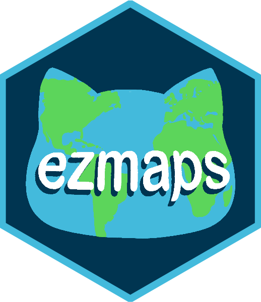

<!-- README.md is generated from README.Rmd. Please edit that file -->

# ezmaps <a href='https://github.com/harvard-stat108s23/ezmaps'></a>

The goal of ezmaps is to help beginners conduct exploratory analysis of
geospatial data via interactive visualizations. This package helps
create the following: point maps, choropleth maps, cartograms, and
hexbin maps.

## Installation

You can install the development version of ezmaps from
[GitHub](https://github.com/) with:

``` r
# install_packages("devtools")
devtools::install_github("harvard-stat108s23/ezmaps")
#> fs           (1.6.2      -> 1.6.4      ) [CRAN]
#> sass         (0.4.6      -> 0.4.9      ) [CRAN]
#> cachem       (1.0.8      -> 1.1.0      ) [CRAN]
#> munsell      (0.5.0      -> 0.5.1      ) [CRAN]
#> glue         (1.6.2      -> 1.7.0      ) [CRAN]
#> farver       (2.1.1      -> 2.1.2      ) [CRAN]
#> cli          (3.6.1      -> 3.6.3      ) [CRAN]
#> wk           (0.7.3      -> 0.9.1      ) [CRAN]
#> tinytex      (0.45       -> 0.51       ) [CRAN]
#> fontawesome  (0.5.1      -> 0.5.2      ) [CRAN]
#> bslib        (0.5.0      -> 0.7.0      ) [CRAN]
#> highr        (0.10       -> 0.11       ) [CRAN]
#> evaluate     (0.21       -> 0.24.0     ) [CRAN]
#> e1071        (1.7-13     -> 1.7-14     ) [CRAN]
#> units        (0.8-2      -> 0.8-5      ) [CRAN]
#> s2           (1.1.4      -> 1.1.6      ) [CRAN]
#> DBI          (1.1.3      -> 1.2.3      ) [CRAN]
#> classInt     (0.4-9      -> 0.4-10     ) [CRAN]
#> terra        (1.7-39     -> 1.7-78     ) [CRAN]
#> xfun         (0.39       -> 0.45       ) [CRAN]
#> sp           (2.0-0      -> 2.1-4      ) [CRAN]
#> leaflet.p... (1.9.0      -> 2.0.0      ) [CRAN]
#> crosstalk    (1.2.0      -> 1.2.1      ) [CRAN]
#> yaml         (2.3.7      -> 2.3.8      ) [CRAN]
#> rmarkdown    (2.22       -> 2.27       ) [CRAN]
#> knitr        (1.43       -> 1.47       ) [CRAN]
#> jsonlite     (1.8.5      -> 1.8.8      ) [CRAN]
#> rlang        (1.1.1      -> 1.1.4      ) [CRAN]
#> fastmap      (1.1.1      -> 1.2.0      ) [CRAN]
#> digest       (0.6.31     -> 0.6.35     ) [CRAN]
#> sfheaders    (0.4.3      -> 0.4.4      ) [CRAN]
#> geometries   (0.2.3      -> 0.2.4      ) [CRAN]
#> Rcpp         (1.0.10     -> 1.0.12     ) [CRAN]
#> sf           (1.0-13     -> 1.0-16     ) [CRAN]
#> raster       (3.6-20     -> 3.6-26     ) [CRAN]
#> leaflet      (2.1.2      -> 2.2.2      ) [CRAN]
#> htmlwidgets  (1.6.2      -> 1.6.4      ) [CRAN]
#> htmltools    (0.5.5      -> 0.5.8.1    ) [CRAN]
#> vctrs        (0.6.2      -> 0.6.5      ) [CRAN]
#> purrr        (1.0.1      -> 1.0.2      ) [CRAN]
#> XML          (3.99-0.14  -> 3.99-0.16.1) [CRAN]
#> stars        (0.6-1      -> 0.6-5      ) [CRAN]
#> lwgeom       (0.2-13     -> 0.2-14     ) [CRAN]
#> utf8         (1.2.3      -> 1.2.4      ) [CRAN]
#> fansi        (1.0.4      -> 1.0.6      ) [CRAN]
#> tidyselect   (1.2.0      -> 1.2.1      ) [CRAN]
#> askpass      (1.1        -> 1.2.0      ) [CRAN]
#> openssl      (2.0.6      -> 2.2.0      ) [CRAN]
#> curl         (5.0.1      -> 5.2.1      ) [CRAN]
#> stringi      (1.7.12     -> 1.8.4      ) [CRAN]
#> crayon       (1.5.2      -> 1.5.3      ) [CRAN]
#> leafem       (0.2.0      -> 0.2.3      ) [CRAN]
#> dplyr        (1.1.2      -> 1.1.4      ) [CRAN]
#> uuid         (1.1-0      -> 1.2-0      ) [CRAN]
#> httr         (1.4.6      -> 1.4.7      ) [CRAN]
#> RcppArmad... (0.12.6.6.1 -> 0.12.8.4.0 ) [CRAN]
#> packcircles  (0.3.5      -> 0.3.6      ) [CRAN]
#> tmap         (3.3-3      -> 3.3-4      ) [CRAN]
#> tigris       (2.0.3      -> 2.1        ) [CRAN]
#> readr        (2.1.4      -> 2.1.5      ) [CRAN]
#> geogrid      (0.1.1      -> 0.1.2      ) [CRAN]
#> 
#>   There is a binary version available but the source version is later:
#>     binary source needs_compilation
#> cli  3.6.2  3.6.3              TRUE
#> 
#>   Binaries will be installed
#> package 'fs' successfully unpacked and MD5 sums checked
#> package 'sass' successfully unpacked and MD5 sums checked
#> package 'cachem' successfully unpacked and MD5 sums checked
#> package 'munsell' successfully unpacked and MD5 sums checked
#> package 'glue' successfully unpacked and MD5 sums checked
#> package 'farver' successfully unpacked and MD5 sums checked
#> package 'cli' successfully unpacked and MD5 sums checked
#> package 'wk' successfully unpacked and MD5 sums checked
#> package 'tinytex' successfully unpacked and MD5 sums checked
#> package 'fontawesome' successfully unpacked and MD5 sums checked
#> package 'bslib' successfully unpacked and MD5 sums checked
#> package 'highr' successfully unpacked and MD5 sums checked
#> package 'evaluate' successfully unpacked and MD5 sums checked
#> package 'e1071' successfully unpacked and MD5 sums checked
#> package 'units' successfully unpacked and MD5 sums checked
#> package 's2' successfully unpacked and MD5 sums checked
#> package 'DBI' successfully unpacked and MD5 sums checked
#> package 'classInt' successfully unpacked and MD5 sums checked
#> package 'terra' successfully unpacked and MD5 sums checked
#> package 'xfun' successfully unpacked and MD5 sums checked
#> package 'sp' successfully unpacked and MD5 sums checked
#> package 'leaflet.providers' successfully unpacked and MD5 sums checked
#> package 'crosstalk' successfully unpacked and MD5 sums checked
#> package 'yaml' successfully unpacked and MD5 sums checked
#> package 'rmarkdown' successfully unpacked and MD5 sums checked
#> package 'knitr' successfully unpacked and MD5 sums checked
#> package 'jsonlite' successfully unpacked and MD5 sums checked
#> package 'rlang' successfully unpacked and MD5 sums checked
#> package 'fastmap' successfully unpacked and MD5 sums checked
#> package 'digest' successfully unpacked and MD5 sums checked
#> package 'sfheaders' successfully unpacked and MD5 sums checked
#> package 'geometries' successfully unpacked and MD5 sums checked
#> package 'Rcpp' successfully unpacked and MD5 sums checked
#> package 'sf' successfully unpacked and MD5 sums checked
#> package 'raster' successfully unpacked and MD5 sums checked
#> package 'leaflet' successfully unpacked and MD5 sums checked
#> package 'htmlwidgets' successfully unpacked and MD5 sums checked
#> package 'htmltools' successfully unpacked and MD5 sums checked
#> package 'vctrs' successfully unpacked and MD5 sums checked
#> package 'purrr' successfully unpacked and MD5 sums checked
#> package 'XML' successfully unpacked and MD5 sums checked
#> package 'stars' successfully unpacked and MD5 sums checked
#> package 'lwgeom' successfully unpacked and MD5 sums checked
#> package 'utf8' successfully unpacked and MD5 sums checked
#> package 'fansi' successfully unpacked and MD5 sums checked
#> package 'tidyselect' successfully unpacked and MD5 sums checked
#> package 'askpass' successfully unpacked and MD5 sums checked
#> package 'openssl' successfully unpacked and MD5 sums checked
#> package 'curl' successfully unpacked and MD5 sums checked
#> package 'stringi' successfully unpacked and MD5 sums checked
#> package 'crayon' successfully unpacked and MD5 sums checked
#> package 'leafem' successfully unpacked and MD5 sums checked
#> package 'dplyr' successfully unpacked and MD5 sums checked
#> package 'uuid' successfully unpacked and MD5 sums checked
#> package 'httr' successfully unpacked and MD5 sums checked
#> package 'RcppArmadillo' successfully unpacked and MD5 sums checked
#> package 'packcircles' successfully unpacked and MD5 sums checked
#> package 'tmap' successfully unpacked and MD5 sums checked
#> package 'tigris' successfully unpacked and MD5 sums checked
#> package 'readr' successfully unpacked and MD5 sums checked
#> package 'geogrid' successfully unpacked and MD5 sums checked
#> 
#> The downloaded binary packages are in
#>  C:\Users\aceme\AppData\Local\Temp\RtmpM7qxyh\downloaded_packages
#> ── R CMD build ─────────────────────────────────────────────────────────────────
#>          checking for file 'C:\Users\aceme\AppData\Local\Temp\RtmpM7qxyh\remotes53982b6b4794\harvard-stat108s23-ezmaps-e9f1746/DESCRIPTION' ...  ✔  checking for file 'C:\Users\aceme\AppData\Local\Temp\RtmpM7qxyh\remotes53982b6b4794\harvard-stat108s23-ezmaps-e9f1746/DESCRIPTION' (1.4s)
#>       ─  preparing 'ezmaps': (498ms)
#>    checking DESCRIPTION meta-information ...     checking DESCRIPTION meta-information ...   ✔  checking DESCRIPTION meta-information
#>       ─  checking for LF line-endings in source and make files and shell scripts
#>       ─  checking for empty or unneeded directories
#>       ─  building 'ezmaps_0.0.0.9000.tar.gz'
#>      
#> 
```

## Functions and examples

You can find these and more code examples for `ezmaps` under
`vignettes`. As interactive maps are rendered as HTML documents, the
outputs for the code examples below cannot be rendered in a `README.md`
file, but can be viewed there or by running the code chunks below in
your console.

### pointmap()

The `pointmap()` function plots geographic latitude/longitude data on an
interactive map. Points can be colored according to the values of a
variable.

This function has the following inputs:

- Required - data, longitude_var, latitude_var, set_longitude,
  set_latitude
- Optional - popups, icon_filepath, icon_width, icon_height, zoom_min,
  zoom_max, set_zoom, map_tile, point_color, point_radius,
  point_inopacity, point_outopacity, user_pal, user_var

If you are creating a point map with circle markers, you are able to use
the following inputs: popups, zoom_min, zoom_max, set_zoom, map_tile,
point_color, point_radius, point_inopacity, point_outopacity, user_pal,
user_var

If you are creating a point map with icon markers, you are able to use
the following inputs: popups, icon_filepath, icon_width, icon_height,
zoom_min, zoom_max, set_zoom, map_tile

``` r
library(ezmaps)
pointmap(data = crash_data,
                  longitude_var = crash_data$lon,
                  latitude_var = crash_data$lat,
                  set_longitude = -71.110558,
                  set_latitude = 42.3736,
                  popups = crash_data$crash_date,
                  user_pal = c("#003f5c", "#2f4b7c","#665191",
                               "#a05195","#d45087","#f95d6a",
                               "#ff7c43","#ffa600"),
                  user_var = crash_data$year)
```

### choropleth()

The `choropleth()` function plots regions and colors the regions
according to the values of a variable.

This function has the following inputs:

- Required - data, variable, geometry
- Optional - palette

``` r
library(ezmaps)
choropleth(data = states,
           variable = "Population",
           geometry = geometry,
           palette = "viridis")
```

### cartogram()

The `cartogram()` function plots regions and distorts their size and
shape according to the values of a variable. The regions can optionally
be colored according to the values of that variable or of another
variable.

This function has the following inputs:

- Required - data, weight, variable, geometry
- Optional - base

``` r
library(ezmaps)
cartogram(data = states,
          weight = "Population",
          variable = "Vegetables",
          geometry = geometry,
          palette = "viridis",
          base = 1)
```

### hexbin()

The `hexbin()` function plots a hexagonal grid fitted to the original
geometry of the geographic regions of interest. Each hexagon represents
one region and is labeled accordingly. The hexagons are colored
according to the values of a variable.

This function has the following inputs:

- Required - data, fill, labels, geometry
- Optional - palette, seed

### tessellate()

The `tessellate()` function is an optional function that allows the user
to preview configurations of hexagonal grids (“seed maps”) across the
original geometry of the geographic regions of interest. To use this
function, the user must call `tessellate()` before `hexbin()`. The user
can then input one of the seed maps created using `tessellate()` as the
base grid used by the `hexbin()` function using the `hexbin(seed)`
argument.

This function has the following inputs:

- Required - data, fill, geometry
- Optional - n

``` r
library(ezmaps)
tessellate(data = states, geometry = geometry, n = 6)
hexbin(data = states,
       fill = "Vegetables",
       labels = "STUSPS",
       geometry = geometry,
       palette = "viridis",
       seed = 4)
```

## Datasets

### crash_data

A tibble with 1311 rows and 5 variables. Contains information on local
pedestrian/cyclist crashes in Cambridge, MA, United States.
[Source](https://github.com/harvard-stat108s23/materials/blob/main/psets/data/cambridge_cyclist_ped_crash.csv)

### states

A simple-feature dataframe with 50 rows and 7 variables. Contains
information on the residents of US states and multipolygon/shapefile
data for the geometries of US states using a combination of the
[Lock5Data::USStates](https://cran.r-project.org/web/packages/Lock5Data/index.html)
&
[tigris::states](https://github.com/walkerke/tigris/blob/master/R/states.R)
datasets, respectively.

## License

### MIT License

Copyright (c) 2023 ezmaps authors

Permission is hereby granted, free of charge, to any person obtaining a
copy of this software and associated documentation files (the
“Software”), to deal in the Software without restriction, including
without limitation the rights to use, copy, modify, merge, publish,
distribute, sublicense, and/or sell copies of the Software, and to
permit persons to whom the Software is furnished to do so, subject to
the following conditions:

The above copyright notice and this permission notice shall be included
in all copies or substantial portions of the Software.

THE SOFTWARE IS PROVIDED “AS IS”, WITHOUT WARRANTY OF ANY KIND, EXPRESS
OR IMPLIED, INCLUDING BUT NOT LIMITED TO THE WARRANTIES OF
MERCHANTABILITY, FITNESS FOR A PARTICULAR PURPOSE AND NONINFRINGEMENT.
IN NO EVENT SHALL THE AUTHORS OR COPYRIGHT HOLDERS BE LIABLE FOR ANY
CLAIM, DAMAGES OR OTHER LIABILITY, WHETHER IN AN ACTION OF CONTRACT,
TORT OR OTHERWISE, ARISING FROM, OUT OF OR IN CONNECTION WITH THE
SOFTWARE OR THE USE OR OTHER DEALINGS IN THE SOFTWARE.
